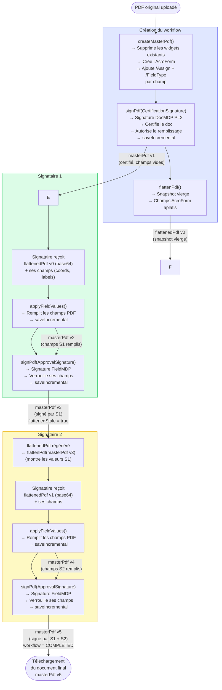
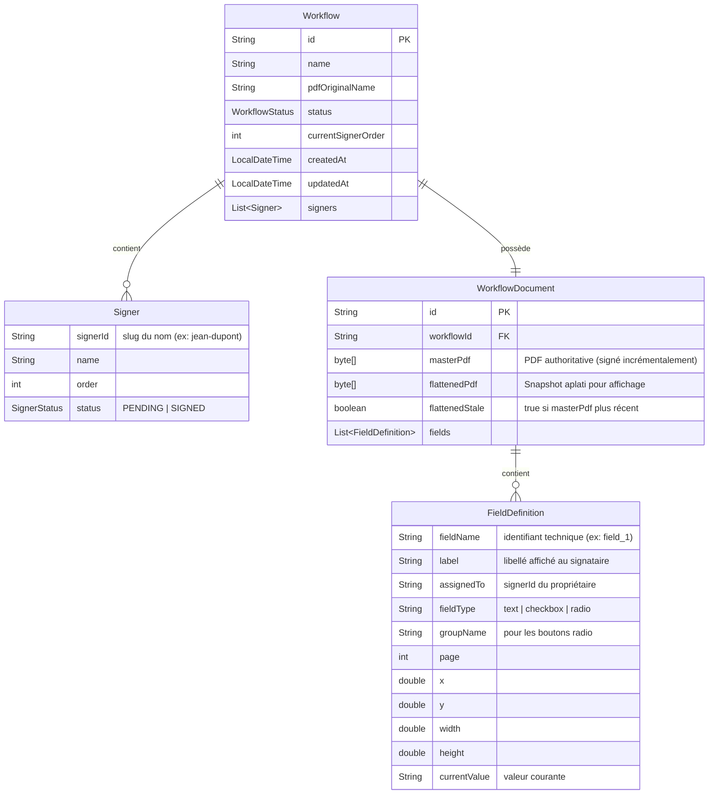

# Cycle de vie du PDF

Ce document décrit comment le PDF est géré depuis la création du workflow jusqu'à la signature finale, en détaillant le rôle du `masterPdf`, ce qui est envoyé à chaque signataire, et le modèle de données sous-jacent.

---

## Concepts fondamentaux

### masterPdf — la source de vérité

Le `masterPdf` est le document PDF authoritative stocké en base MongoDB. C'est lui qui :

- contient les champs AcroForm avec leurs valeurs renseignées
- accumule les signatures numériques de manière incrémentale (chaque signature s'ajoute sans invalider les précédentes)
- est rendu disponible au téléchargement une fois le workflow complété

Il **n'est jamais envoyé directement** aux signataires.

### flattenedPdf — le snapshot de lecture

Le `flattenedPdf` est une copie aplatie du `masterPdf` à un instant donné. L'aplatissement (`acroForm.flatten()`) supprime les champs AcroForm interactifs et les rend dans la couche graphique du PDF — le document devient donc non-modifiable.

Il sert uniquement à **afficher le document** au signataire, en lui montrant les valeurs remplies par les signataires précédents sans lui donner accès aux champs PDF natifs.

Les champs du signataire courant sont superposés côté front-end via des inputs HTML (composant `FieldOverlay`).

### Flag `flattenedStale`

Après chaque remplissage ou signature, le `masterPdf` est mis à jour mais le `flattenedPdf` ne l'est pas immédiatement. Le flag `flattenedStale = true` indique qu'une régénération est nécessaire. Elle est déclenchée au moment où le prochain signataire charge son document.

---

## Signatures numériques

Deux types de signatures sont appliquées :

| Type | Classe | Moment | Rôle |
|------|--------|--------|------|
| **CertificationSignature** (DocMDP P=2) | `CertificationSignature` | À la création | Certifie l'origine du document ; autorise le remplissage de formulaire sans invalider la signature |
| **ApprovalSignature** (FieldMDP) | `ApprovalSignature` | Après chaque signature de signataire | Approuve le contenu ; verrouille les champs du signataire via un `FieldMDP transform` |

Chaque signature est appliquée de manière **incrémentale** (`saveIncremental`) : la signature précédente n'est pas réécrite mais un nouveau incrément est ajouté à la fin du fichier, ce qui permet la vérification de l'intégrité de chaque signature indépendamment.

---

### Notes sur les coordonnées

Les coordonnées des champs (`x`, `y`, `width`, `height`) sont stockées en **points PDF** avec l'origine en bas à gauche (convention PDF). La conversion depuis les coordonnées canvas (origine haut-gauche) est effectuée côté front-end avant envoi :

```
pdfY = pageHeightPt - (canvasY + fieldHeight) / scale
```

## États du masterPdf



---

## Modèle de données



---
